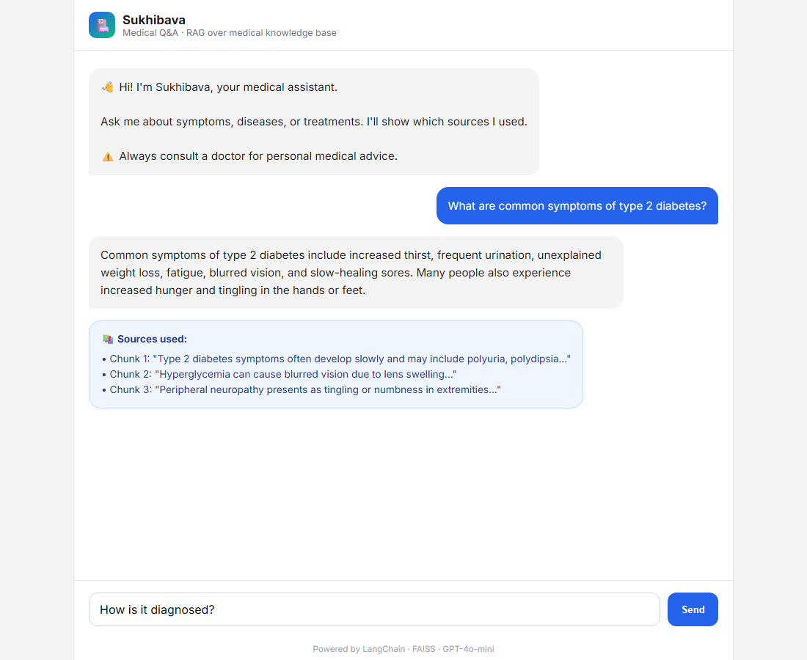

# Sukhibava - Medical Chatbot

A RAG-based medical Q&A chatbot built with LangChain, FAISS, Sentence Transformers, and GPT-4o-mini. Features semantic search over a medical knowledge base with conversation memory.

## Screenshots

| Welcome screen | Medical Q&A | Source citations |
|----------------|-------------|-------------------|
|  |  |  |

## Stack

- **LangChain** — RAG pipeline and conversation memory
- **FAISS** — vector search over medical documents
- **Sentence Transformers** — embeddings
- **GPT-4o-mini** — answer generation
- **Chainlit** — chat UI